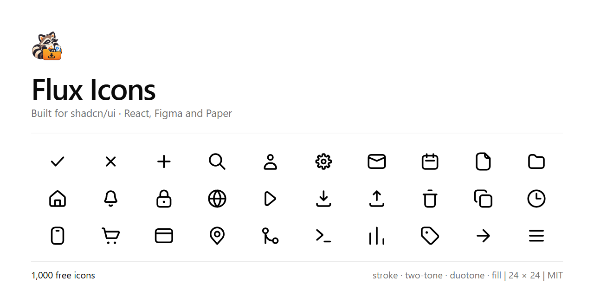

<p align="center">
  
</p>

<div align="center">
  <h1>Flux Icons</h1>
  <p><strong>The High-Precision Icon Ecosystem Engineered for Modern Web Apps, shadcn/ui & React.</strong></p>
  <p>3 Specialized Vaults · 3,700+ Master Glyphs · 21,450+ Production SVGs · Zero Runtime Overhead · 100% Free & MIT.</p>

  <p>
    <a href="https://www.fluxicons.site"></a>
    <a href="https://fluxicons.vercel.app"></a>
    <a href="https://github.com/codewithevilxd/flux-icons/actions/workflows/ci.yml"></a>
    <a href="https://www.npmjs.com/package/@flux-icons/react"></a>
    <a href="https://www.npmjs.com/package/@flux-icons/react"></a>
    <a href="https://github.com/CodewithEvilxd/flux-icons"></a>
    <a href="https://www.figma.com/community/plugin/1672557050316875938/flux-icons"></a>
    <a href="LICENSE"></a>
  </p>

  <p>
    <a href="https://www.fluxicons.site"><strong>Browse Library</strong></a> &nbsp;•&nbsp;
    <a href="https://fluxicons.vercel.app"><strong>Vercel Mirror</strong></a> &nbsp;•&nbsp;
    <a href="#-why-flux-icons"><strong>Why Flux?</strong></a> &nbsp;•&nbsp;
    <a href="#-comparison-matrix"><strong>Comparison</strong></a> &nbsp;•&nbsp;
    <a href="#-the-three-vaults"><strong>The 3 Vaults</strong></a> &nbsp;•&nbsp;
    <a href="#-quick-start"><strong>Quick Start</strong></a> &nbsp;•&nbsp;
    <a href="#-shadcnui-native-registry"><strong>shadcn/ui</strong></a> &nbsp;•&nbsp;
    <a href="#-keyline-system-specification"><strong>Keyline Grid</strong></a> &nbsp;•&nbsp;
    <a href="#-developer--ai-tooling"><strong>AI & MCP Tooling</strong></a> &nbsp;•&nbsp;
    <a href="#-monorepo-packages"><strong>Packages</strong></a> &nbsp;•&nbsp;
    <a href="#-development--contributing"><strong>Contributing</strong></a>
  </p>
</div>

---

## ⚡ Why Flux Icons?

Most icon libraries give you a single style, a loose collection of symbols, and zero interaction capabilities. **Flux Icons** is architected from first principles as a complete visual design system for high-growth digital products:

- 🎯 **3 Specialized Vaults**: Over 3,700 unique glyphs organized across **Keyline**, **Extended**, and **Motion** collections.
- 📐 **Dual Corner Geometry**: Every Keyline icon is drawn twice from scratch: **Rounded** (smooth filleted corners) and **Sharp** (clean architectural butt-caps).
- ✨ **Interactive Micro-Animations**: 467 native Framer Motion components with responsive hover, tap, loop, and stateful triggers.
- ⚡ **Direct shadcn/ui Registry**: Add isolated icon components directly to your codebase with `npx shadcn add @flux/name` with zero runtime dependencies.
- 🤖 **AI Agent Native (MCP Server)**: Official Model Context Protocol integration enabling Cursor, Claude Code, Windsurf, and Antigravity to search and inspect icons in real time.
- 🚀 **Zero Runtime Bloat**: Direct SVG rendering with pure CSS/Tailwind color inheritance (`currentColor`) and minimal bundle footprint.
- 🎨 **Unified 24×24 Geometry**: Designed on a consistent coordinate system with mathematical corner-radiuses and optical balance across all glyphs.

---

## 📊 Comparison Matrix

| Feature | Flux Icons | Lucide | Heroicons | Phosphor |
| :--- | :---: | :---: | :---: | :---: |
| **Total Icons Available** | **3,700+** | ~1,450 | ~290 | ~1,250 |
| **Specialized Icon Vaults** | **3 (Keyline, Extended, Motion)** | 1 | 1 | 1 |
| **Production SVGs** | **21,450+** | ~1,450 | ~1,160 | ~7,500 |
| **Dual Corner Geometry** | **Both Rounded & Sharp** | Rounded only | Rounded only | Rounded only |
| **Interactive Motion Components** | **Native (467 Framer Motion)** | Community | None | None |
| **shadcn/ui Native Registry** | **Native Direct (`@flux/*`)** | Manual copy | Manual copy | Manual copy |
| **Official AI MCP Server** | **Native (`@flux-icons/mcp`)** | None | None | None |
| **Optical Sizing Compensation** | **Mathematical Shapes** | Loose | Loose | Loose |
| **License** | **MIT (100% Free)** | ISC | MIT | MIT |

---

## 🏛️ The Three Vaults

Flux Icons organizes its 3,700+ glyphs into three distinct collections so that every part of your application gets the exact visual density it needs:

| Vault | Master Glyphs | Production Files | Styles & Treatments | Primary Use Case |
| :--- | :---: | :---: | :--- | :--- |
| **01. Keyline** | `1,000` | 8,000 SVGs | `stroke`, `two-tone`, `duotone`, `fill` (Rounded & Sharp) | Core product navigation, actions, toolbars, and design system primitives. |
| **02. Extended** | `2,242` | 13,450+ SVGs | `Linear`, `Bold`, `Two-Tone`, `Bulk`, `Broken`, `Outline` | Fintech, e-commerce, dashboards, crypto, settings panels, and complex workflows. |
| **03. Motion** | `467` | 467 Components | Framer Motion interactive micro-animations | Hero sections, active toggle feedback, notifications, and micro-delight. |

---

## 🚀 Quick Start

### Installation

Install `@flux-icons/react` using your favorite package manager:

```bash
# pnpm (recommended)
pnpm add @flux-icons/react

# npm
npm install @flux-icons/react

# yarn
yarn add @flux-icons/react

# bun
bun add @flux-icons/react
```

---

### 1. Keyline React Icons (`@flux-icons/react`)

Keyline icons feature clean 24×24 geometry and full tree-shakable subpath imports:

```tsx
import { ArrowUpRight, Check, Menu } from "@flux-icons/react"
import { Folder as FolderTwoTone } from "@flux-icons/react/two-tone"
import { Folder as FolderDuotone } from "@flux-icons/react/duotone"
import { Folder as FolderFill } from "@flux-icons/react/fill"
import { Folder as FolderSharp } from "@flux-icons/react/sharp"
import { Folder as FolderSharpFill } from "@flux-icons/react/sharp/fill"

export function Navbar() {
  return (
    <nav className="flex items-center gap-4">
      {/* Default rounded stroke */}
      <Check className="size-5 text-emerald-500" />
      <ArrowUpRight size={20} strokeWidth={2} />
      
      {/* Two-tone style (outline with 40% plate) */}
      <FolderTwoTone className="size-6 text-indigo-500" />
      
      {/* Duotone style (no outline, tonal contrast) */}
      <FolderDuotone className="size-6 text-sky-500" />
      
      {/* Sharp architectural corner treatment */}
      <FolderSharpFill className="size-6 text-neutral-800 dark:text-neutral-200" />
    </nav>
  )
}
```

#### React Component Props

All Keyline icons accept standard SVG attributes and custom sizing props:

| Prop | Type | Default | Description |
| :--- | :--- | :--- | :--- |
| `size` | `number \| string` | `24` | Width and height in pixels (or CSS units) |
| `color` | `string` | `"currentColor"` | Color applied to strokes and fills |
| `strokeWidth` | `number` | `2` | Stroke width on the 24×24 coordinate grid |
| `className` | `string` | `""` | Tailwind or CSS classes for dynamic styling |
| `...props` | `SVGProps<SVGSVGElement>` | — | Standard SVG HTML attributes |

---

### 2. Extended React Icons

Import rich dashboard, commerce, fintech, and settings icons across 6 distinct weights:

```tsx
import { 
  CardSend, 
  DirectboxNotif, 
  Element3, 
  WalletMoney 
} from "@/components/extended-icons/icons"

export function DashboardHeader() {
  return (
    <div className="flex items-center gap-4">
      <CardSend className="size-6 text-blue-500" />
      <DirectboxNotif className="size-6 text-violet-500" />
      <WalletMoney className="size-6 text-emerald-500" />
      <Element3 className="size-6 text-neutral-700 dark:text-neutral-300" />
    </div>
  )
}
```

---

### 3. Motion Icons (Interactive Micro-Animations)

Bring tactile micro-interactions to buttons, notifications, and indicators using Framer Motion:

```tsx
import { BellMotion, HeartMotion, CheckMotion } from "@/components/motion-icons/icons"

export function InteractiveToolbar() {
  return (
    <div className="flex items-center gap-4">
      {/* Animate on hover */}
      <BellMotion trigger="hover" className="size-6 cursor-pointer text-amber-500" />
      
      {/* Trigger on click / tap */}
      <HeartMotion trigger="click" className="size-6 cursor-pointer text-rose-500" />
      
      {/* Controlled state */}
      <CheckMotion isCompleted={true} className="size-6 text-emerald-500" />
    </div>
  )
}
```

---

## ⚡ shadcn/ui Native Registry

Flux Icons natively serves a [shadcn/ui](https://ui.shadcn.com) compatible registry directly from the documentation site.

### Step 1: Add Registry Configuration

In your project's `components.json`:

```json
{
  "registries": {
    "@flux": "https://www.fluxicons.site/r/{name}.json"
  }
}
```

### Step 2: Add Any Icon Directly via CLI

```bash
# Add default rounded stroke icon
npx shadcn add @flux/bell

# Add filled variant
npx shadcn add @flux/fill/bell

# Add sharp corner fill variant
npx shadcn add @flux/sharp/fill/bell
```

Each icon lands in your project as an isolated, zero-dependency React component that you own and can edit freely!

### Step 3: Use with shadcn Components

```tsx
import { Button } from "@/components/ui/button"
import { Bell } from "@/components/icons/bell"
import { ArrowRight } from "@/components/icons/arrow-right"

export function NotificationAction() {
  return (
    <Button variant="default" className="gap-2 group">
      <Bell className="size-4" />
      Enable Alerts
      <ArrowRight className="size-4 transition-transform group-hover:translate-x-0.5" />
    </Button>
  )
}
```

---

## 🎨 UI Recipes & Best Practices

### A. Dynamic Color & Theme Inheritance

Flux Icons use `currentColor` for both stroke and fill elements, automatically inheriting foreground color tokens across light and dark modes:

```tsx
{/* Inherits text color directly from Tailwind classes */}
<Check className="size-5 text-emerald-600 dark:text-emerald-400" />
<Menu className="size-6 text-muted-foreground hover:text-foreground transition-colors" />
```

### B. Responsive Sizing with Tailwind CSS

```tsx
<ArrowUpRight className="size-4 sm:size-5 md:size-6 transition-all" />
```

---

## 📐 Keyline System Specification

**1,000 icons, drawn on one 24×24 grid, in four styles and two corner treatments.** Built for shadcn/ui, free under MIT.

Flux Icons provides a complete visual language designed on a strict 24×24 coordinate grid with 2px stroke geometry. Every glyph is measured, balanced, and available across four distinct visual styles and two mechanical corner treatments.

| Style | Icons | Description |
| --- | --- | --- |
| `stroke` | 1,000 | The full set. 2px keylines on a 24 grid. |
| `two-tone` | 1,000 | The stroke drawing over a flat plate at reduced opacity. |
| `duotone` | 1,000 | No outline: a grey body with the detail in full strength. |
| `fill` | 1,000 | Solid, with the detail knocked back out of the shape. |

`stroke` is the drawing every other style starts from, and since 1.0.0 every name comes in all four. `two-tone` is what `duotone` meant until 0.9.0: the outline kept, a 40% plate under it. `duotone` now drops the outline and decides per icon which part is grey and which is black, so the thing that matters reads first: the check on a badge, the liquid in a flask, the data rather than the chart's axes. A glyph with nothing to fill, like `bar-chart`, carries its stroke drawing in the filled styles, so no import ever comes up empty.

### Dual Corner Geometry (Rounded & Sharp)

Every drawing in the table comes twice: rounded, with round caps and filleted corners, and sharp, with butt caps and square corners. Same names, same coverage, so 8,000 SVGs in total.

```
icons/stroke/bell.svg               # Rounded stroke
icons/fill/bell.svg                 # Rounded fill
icons/sharp/stroke/bell.svg         # Sharp stroke
icons/sharp/fill/bell.svg           # Sharp fill
```

Sharp is a drawing of its own rather than a filter over the rounded one. Squaring a corner moves the ink, and where that changes the silhouette the geometry was solved again, so both treatments sit side by side in `raw/` and the build converts neither into the other.

### Precision Containers

56 icons come in a `square-` form and 61 in a `circle-` form, which wrap the base drawing rather than replacing it:

```
icons/stroke/arrow-down.svg
icons/fill/square-arrow-down.svg
icons/sharp/duotone/circle-arrow-down.svg
```

A `square-` or `circle-` prefix does not always mean a container. `circle-half` and `square-dashed` are shapes in their own right, with no base for them to contain, so they are filed as regular icons. The rule is that the base has to exist before the prefix means anything.

---

## 🛠️ Developer & AI Tooling

### A. AI Assistant MCP Server (`@flux-icons/mcp`)

Give your AI coding companion (Claude Code, Cursor, Windsurf, Antigravity) native access to search, inspect, and import any icon accurately:

```bash
# In Claude Code / Claude Desktop:
claude mcp add flux-icons -- npx -y @flux-icons/mcp
```

Or add to your `.cursor/mcp.json` or `.mcp.json`:

```json
{
  "mcpServers": {
    "flux-icons": {
      "command": "npx",
      "args": ["-y", "@flux-icons/mcp"]
    }
  }
}
```

Now you can prompt your AI directly:
> *"Search Flux Icons for a credit card icon in sharp fill style and import it into my checkout component."*

### B. Terminal CLI (`@flux-icons/cli`)

Search and download icons straight to your filesystem without adding packages:

```bash
# Search icons by keyword
npx @flux-icons/cli search arrow

# Download SVGs into an output folder
npx @flux-icons/cli add circle-arrow-down bell --out src/icons

# Specify styles and corner treatments
npx @flux-icons/cli add bell --style fill --corners sharp
```

### C. Direct SVG Files

Optimized, production-ready SVGs with no classes, wrappers, or IDs are available directly from the repository under `icons/`:

```
icons/
├── stroke/               # Rounded stroke SVGs
├── two-tone/             # Rounded two-tone SVGs
├── duotone/              # Rounded duotone SVGs
├── fill/                 # Rounded fill SVGs
└── sharp/
    ├── stroke/           # Sharp stroke SVGs
    ├── two-tone/         # Sharp two-tone SVGs
    ├── duotone/          # Sharp duotone SVGs
    └── fill/             # Sharp fill SVGs
```

### D. Vue, Svelte, Solid & Vanilla (Iconify)

The entire set is indexed on [Iconify](https://icon-sets.iconify.design/flux-icons/) as `flux-icons`:

```html
<!-- Iconify Web Component / Framework Integrations -->
<iconify-icon icon="flux-icons:bell"></iconify-icon>
<iconify-icon icon="flux-icons:bell-fill"></iconify-icon>
<iconify-icon icon="flux-icons:bell-sharp-duotone"></iconify-icon>
```

### E. Figma Community & Design Assets

- **[Figma Community Plugin](https://www.figma.com/community/plugin/1672557050316875938/flux-icons)**: Instant icon browser inside Figma with style and corner switching.
- **[Figma Community File](https://www.figma.com/community/file/1672255957017818239/flux-icons)**: The complete vector design system with interactive component properties.

---

## 📦 Monorepo Packages

The repository is maintained as an organized pnpm monorepo containing three npm packages and one Figma plugin:

| Package | Purpose | Distribution |
| :--- | :--- | :--- |
| [`@flux-icons/react`](packages/react) | Tree-shakable React components with subpath exports | [npm](https://www.npmjs.com/package/@flux-icons/react) |
| [`@flux-icons/cli`](packages/cli) | Terminal search and download utility | [npm](https://www.npmjs.com/package/@flux-icons/cli) |
| [`@flux-icons/mcp`](packages/mcp) | MCP server for Claude, Cursor, and AI agents | [npm](https://www.npmjs.com/package/@flux-icons/mcp) |
| [`packages/figma-plugin`](packages/figma-plugin) | Native Figma editor plugin | [Figma Community](https://www.figma.com/community/plugin/1672557050316875938/flux-icons) |

---

## 🗂️ Categories

The icon set spans 39 comprehensive categories designed to meet real production application needs:

Actions, AI, Animals, Art, Charts, Chevrons & Carets, Circle Containers, Commerce, Controls, Devices, Diagrams, Education, Emoji, Files, Finance, Food & Drink, Gender, Git, Health, Home, Layout, Mail, Maps, Media, Nature, Pointers, Science, Shapes, Sport, Square Containers, Stationery, Text, Time, Tools, Transport, Users, Weather, Web, plus specialized utility glyphs.

Release updates and redraws are detailed in the [Changelog](https://www.fluxicons.site/changelog).

---

## 📁 Repository Architecture

```
flux-icons/
├── .github/               # CI workflows, issue templates & funding config
├── .vscode/               # Workspace recommended settings
├── icons/                 # 8,000 production SVGs (normalized & checked)
├── packages/              # Monorepo packages (react, cli, mcp, figma-plugin)
├── pipeline/              # Build pipelines, linters & geometric tools
│   ├── build.mjs          # Compiles raw Figma vectors to icons/
│   ├── build-react.mjs    # Compiles Keyline React components
│   ├── build-extended.mjs # Compiles Extended React components (2,242 icons)
│   ├── build-motion.mjs   # Compiles Framer Motion animated icons (467 icons)
│   ├── build-data.mjs     # Generates search & metadata bundles
│   ├── lint.mjs           # Geometry, padding & ink-box verification
│   ├── ship.mjs           # Automated release & packaging pipeline
│   └── tools/             # Mathematical shape solvers & geometry generators
├── previews/              # Social cards, posters & Figma covers
├── public/                # Static brand assets & logo vectors
├── raw/                   # Figma SVG exports (Single Source of Truth)
└── src/                   # Next.js App Router & web applications
```

> [!IMPORTANT]
> **Source of Truth Rule:** `icons/`, `src/components/icons/`, `packages/*/src/`, and `packages/*/icons.json` are generated artifacts. Never edit them by hand. The single source of truth is `raw/`. Any change to a drawing must be made in `raw/` and compiled through the build pipeline.

---

## 💻 Development & Contributing

Prerequisites: **Node.js >= 20.9** and **pnpm**.

```bash
# 1. Install workspace dependencies
pnpm install

# 2. Run the Next.js documentation & browser site
pnpm dev

# 3. Compile raw Figma exports into normalized SVGs
pnpm icons:build

# 4. Generate React components across packages and web catalog
pnpm icons:react
pnpm icons:extended:build
pnpm icons:motion:build

# 5. Run geometry, ink-box, and padding linters
pnpm icons:lint

# 6. Execute full CI verification suite (all 15 checks + tsc)
pnpm icons:ci
```

### Committing Drawings

For updates involving icon geometry or files under `raw/`, use the automated shipping pipeline:

```bash
pnpm ship -m "Add clipboard-check icon"
```

`pnpm ship` regenerates SVGs, rebuilds component exports, verifies geometry against strict linter rules, commits the diff, synchronizes git history timestamps in `src/lib/icon-history.json`, and folds the changes back into the release commit.

For detailed information on geometric tolerances, stroke envelopes, and corner radiuses, refer to [pipeline/README.md](pipeline/README.md) and [CONTRIBUTING.md](CONTRIBUTING.md).

---

## 🤝 Sponsors

<!-- SPONSORS:start -->

[Shadcn UI Community](https://ui.shadcn.com), since August 2026.

<!-- SPONSORS:end -->

---

## 📄 License

Flux Icons is open-source software licensed under the [MIT License](LICENSE). Built and maintained with precision by Nishant Gaurav ([@codewithevilxd](https://github.com/codewithevilxd)).
